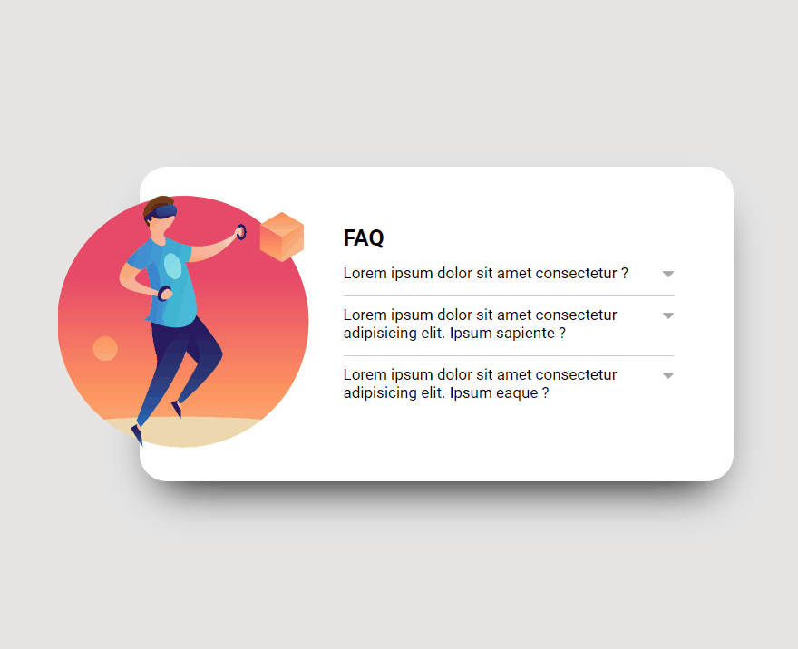

# Acordeon-JS

## Sumário

- [Sobre o projeto](#sobreoprojeto)
- [Layout  desktop](#layout-desktop)
- [Tecnologias utilizadas](#tecnologias-utilizadas)
- [O que eu aprendi](#o-que-eu-aprendi)
- [Acesso a página](#acesso-a-página)

## Sobre o projeto

Esse projeto se trata da primeira versão de um acordeon, onde ao clicar em uma pergunta acontece uma animação para abrir o item e mostrar o texto escondido, com isso seta muda de cor. Para selecionar outra pergunta basta clicar nela e a anterior fechara, para abrir a proxima pergunta basta clicar novamente. Você pode acessar a segunda versão mais aprimorada de meu acordeon [clicando aqui ](https://github.com/ClariCassia/Meu-acordeon-JS)
 
 

## Layout desktop    

 

     
 
 

## Tecnologias utilizadas

- HTML
- CSS
- JS

## O que eu aprendi

Neste projeto,pude colocar em prática meus conhecimentos de CSS. Nele também pude prática a manipulação do DOM, adicionando e removendo classes através do JS, exercitando a lógica utilizando forEach e addEventListener.

## Acesso a página

Para ver o projeto pronto [clique aqui ]()
# Acordeonsimples-JS
